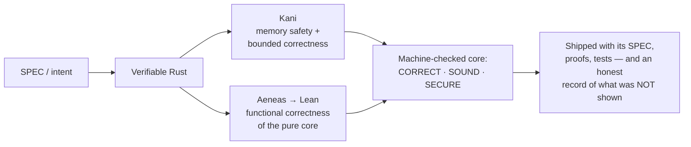
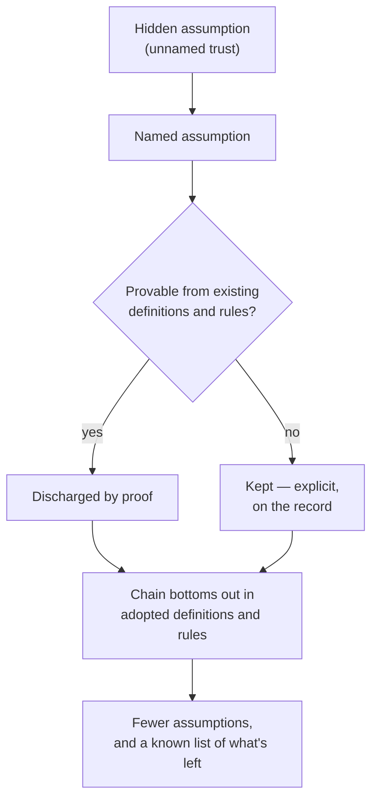
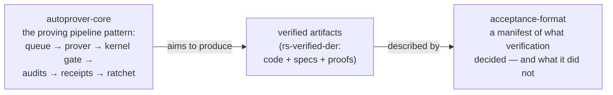

> This page is the refined presentation of this profile — written by Claude from the author's own [README](README.md) and public repositories. The ideas, the bets, and the working rules are the author's; the prose is the machine's. That division of labor is itself the subject of this page.

# Ivo Matijašević

> **Software becomes mathematics.**

Mathematician — MSc in mathematics and computer science — with 10+ years building Erlang systems that were not allowed to fall over. Now building the thing I think comes next: an estate of tools, formats, and verified code for a world where machines write most of the software — and have to *prove* it.

---

## The bet

Software is about to make the jump civil engineering made when it went from brick to reinforced concrete. You can suddenly build far higher and far stronger — but only with deeper foundations and steel inside the walls.

**Model checking is the steel.** The depth is clarity: precise assumptions, definitions, and rules for the system — with everything else *proven*.

Hardware learned this decades ago; software mostly went without, because manually written specs and proofs were too slow and too expensive outside a few niches and academia. **LLMs change the economics.** Writing verifiable code — and actually verifying it — becomes cheap at scale. When proof becomes cheap, the interesting question stops being *"can we afford to verify?"* and becomes *"what deserves to be trusted, and on what grounds?"*

On that view, software splits into three futures:

| path | what it is | what guards it |
|---|---|---|
| **Legacy** | existing code and apps, not built for LLM autonomy | habit, tests, hope |
| **"Disposable code"** | an LLM-produced app for a single use case | nothing — and for throwaway stakes, that's fine |
| **"Correct code"** | code *derived from a spec*, shipped with proofs of the properties that matter | mathematics |

The third path is the one worth building infrastructure for. Its critical core must be:

- **CORRECT** — satisfies the SPEC on *every* input, covered by proofs and tests.
- **SOUND** — no panics, no undefined behavior, no silent corruption.
- **SECURE** — the properties that protect users hold *by construction*, not by testing effort.

## Why Rust, why now

My working assumption is that Rust is the language this future runs on. The evidence for the bet:

- Around 70% of critical vulnerabilities in large C/C++ codebases are memory-safety bugs — Microsoft's figure for its own products, with Chromium reporting a similar share.
- U.S. agencies (CISA, NSA, FBI) are pushing vendors toward [memory-safe roadmaps for critical software](https://thenewstack.io/feds-critical-software-must-drop-c-c-by-2026-or-face-risk/).
- Rust is entering safety-critical territory: qualified automotive toolchains, footholds in the Linux kernel and embedded systems.
- AWS and the Rust Foundation are [funding formal verification of the Rust standard library itself](https://foundation.rust-lang.org/news/rust-foundation-collaborates-with-aws-initiative-to-verify-rust-standard-libraries/) — the [verify-rust-std](https://model-checking.github.io/verify-rust-std/) effort.

Safe Rust deletes, *by construction*, the bug class that dominates C/C++ vulnerability counts — which frees the entire verification budget for what actually matters: functional correctness. Hence the tool choices here: **Kani** for model checking (memory safety, bounded correctness) and **Aeneas → Lean** for proving functional correctness of pure code, with heavier deductive tools (Creusot, Verus) available when the work demands them.

## Ground what can be grounded — no hidden assumptions

Every system rests on assumptions. The dangerous ones are the *hidden* ones — trust taken without ever being named. The working rule of this whole estate:

> **A statement is either proven from other statements and assumptions, or it is explicitly stated as assumed. There is no third category.**

The obvious place correctness gets assumed silently: third-party libraries, tools, compilers, hardware. With LLMs, those assumptions can finally be made *loud* — named explicitly and handed to machines to check, because no human has time to check them all. The goal is to prove the chain from core assumptions up to the code actually running, until it bottoms out in definitions and rules good enough to prove against. Everything becomes mathematics — not just mathematics and theoretical physics — because LLMs make it cheap.

**Reduce assumptions, never eliminate them — and know what's left.**

## The estate

The public work forms one system: a machine that produces proofs, verified code it aims at, and a record format that states honestly what was — and was not — established.

*(The diagram shows the intended shape of the work, not a finished automated chain — each repo states precisely what is established today.)*

### [acceptance-format](https://github.com/ivmat/acceptance-format) — the record layer

A format for recording **what verification decided, including what it did not.** Every claim in an `acceptance.toml` manifest is tied to its evidence, and the format is *fail-closed by design*: a claim earns the format's **weight** only by supplying a grade, a runnable recipe, and a witness that the recipe can fail. Anything short of that stays **visible but honestly unweighted** — the format refuses weight, never the claim. Subject-agnostic by construction; currently exercised on Rust formal-verification work, with rs-verified-der as its first trial subject. Status: `0.1.0-draft`, living.

Why it matters: a green badge says "something passed." A manifest says *what* was checked, *how strongly*, *under which assumptions*, and *how to re-run it yourself* — and admits, in the same breath, everything it cannot vouch for. That second half is the part the industry keeps skipping.

### [autoprover-core](https://github.com/ivmat/autoprover-core) — the machine's public core

Not the full engine — the **core pattern of one**, published as a showcase of a proof-producing autonomous LLM-based machine. Three parts, meant to be read together:

- a **corpus of 74 machine-checked Lean modules** across seven areas (distributed systems, concurrency, order theory, process calculi, security, probability, reliability) — every module cataloged with an *honest scope flag* (`full` for the standard result at full generality, `scoped` for a deliberate restriction, with the restriction stated), enforced mechanically;
- the **architecture** of the kind of automated proving pipeline that produces such corpora — including its honest limits, stated in their own document;
- a dependency-free **reference implementation** of that pipeline: versioned receipts, an append-only work queue, a pluggable kernel gate, structural audit checks (vacuity, unexercised hypotheses, name/content correspondence), and a monotone ratchet — the proven set only shrinks through a logged removal event.

### [rs-verified-der](https://github.com/ivmat/rs-verified-der) — the verified artifact

A formally verified DER (X.690) encoder/decoder in Rust — small and foundational by design, because certificate parsing is exactly the kind of code that must never lie. Kani proves memory safety and bounded correctness; Aeneas extracts the pure core to Lean, where functional correctness is proven.

### Upstream — backing the tools I rely on

The estate stands on Kani and Aeneas, so part of the work goes back upstream: merged improvements to [Kani](https://github.com/model-checking/kani) (e.g. [#4723](https://github.com/model-checking/kani/pull/4723), [#4743](https://github.com/model-checking/kani/pull/4743), [#4744](https://github.com/model-checking/kani/pull/4744)), an open [RFC on machine-readable verification output](https://github.com/model-checking/kani/issues/4727), and active participation in the [verify-rust-std](https://github.com/model-checking/verify-rust-std) verification challenges.

### The papers

I looked for existing work on the reliability of gated agentic computation — pipelines where generated work must pass a verifying gate — found none, and wrote three:

1. [A fault-tolerance threshold for gated agentic computation](https://zenodo.org/records/20820968)
2. [Generated gates inherit their generator's blind spots](https://zenodo.org/records/20837102)
3. [Escape, cost, and correlation at the verification floor of gated agentic computation](https://zenodo.org/records/21456783)

## How this estate is actually run

This is the part I would want to read on anyone else's page, so here is mine, plainly.

**Almost nothing here is handwritten.** The only handwritten text in the repos I own is the plain [README](README.md) behind this page. Everything else — code, proofs, specs, documentation, this very page — is LLM-produced, then reviewed and adapted. The repos are holders of a product *and* of the long-term memory LLM workers need to act correctly inside them; that dual role can make them denser than a conventional codebase, and I have adopted Simple Technical English and [arc42](https://arc42.org) documentation structure to keep them navigable.

**The standing priority is honesty over polish.** Repos must not overstate their results and claims — that rule outranks looking good. It is enforced, not assumed:

- **Watched-fail discipline.** A green check nobody watched fail is untested. Evidence here carries witnesses that the check *can* go red — planted defects observed failing before the green is believed.
- **Honest scope flags, machine-enforced.** A restricted result is labeled restricted, with the restriction stated, and a gate fails the build if a label goes missing.
- **Multi-model review.** Claude is the primary reasoner and workhorse; ChatGPT and Gemini serve as cross-family reviewers — more seats welcome as resources allow. Review findings are adjudicated, dispositioned, and kept — not summarized away.
- **Assumptions stated loudly.** Every repo names what it rests on, in a dedicated file, including the uncomfortable entries.

**Why the model roster is not the critical part.** In formally verified work, *the verifier is the oracle*. A proof either checks or it doesn't, and the checker is deterministic — so an LLM in the loop is a proposal generator, never a trusted authority. The model's output is nondeterministic; the *acceptance* of it is not. All a model must be is a good-enough heuristic to escape local maxima while searching for a proof: a model failure is a local failure — a worse proof, a slower search, an item left unproven — and long-term oracle-grounding straightens it out. It cannot smuggle an unsound result past the kernel.

The honest boundary of that argument: it holds exactly where a strong oracle gates the output. Where no oracle exists — writing the spec that captures *intent*, wording the claims around the proofs — model failures are not self-correcting, and blind spots can correlate when one model both produces and reviews the same artifact (that is what the second paper is about). That is precisely where the cross-family reviewers earn their place, and why the claims discipline is enforced by review rather than assumed.

## The hard part moves to the SPEC

LLMs make it easy to check code against a spec. The hard part becomes: *what should the spec say?* That remains a human endeavour, because it is about agreement on intent — even where LLMs draft the mechanical parts. As machines absorb the model-checking work, human attention should move up to specifications that correspond to intent. That is the second pillar of this future, the first being quick and easy model checking. (No ongoing work on this pillar at the moment — it is next.)

## A note on scale, honestly

None of this is easy, or truly manageable by one person. But the steps are feasible, and I think they are *necessary* long-term for LLM-generated code in any system that matters. Autonomous artifact-producing systems must remain easily auditable, person-overridable, and safe — that is the whole point of the shift-left move: reduce the problem-source surfaces to specs, mechanize the rest, and leave no crack for hidden, unwanted intent to leak into the produced artifacts. In the end an "artifact" here is usually code — a commit is the primary example — but the discipline generalizes to anything a machine produces and a human must trust.

If any of this is useful to you — the format, the corpus, the verified code, or just the working rules — it is public precisely so you can take it.
