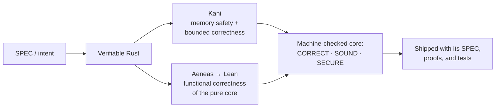
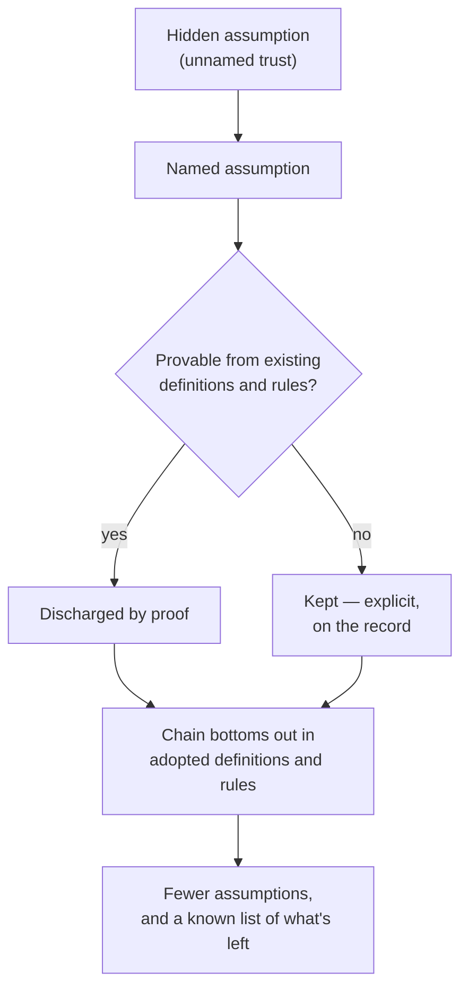

> A refined presentation of this profile — generated by Claude from the author's own [README](README.md). The ideas are his; only the prose is polished.

# Ivo Matijašević

> Software becomes mathematics.

Mathematician — MSc in mathematics and computer science — with 10+ years building Erlang systems.

## Model checking: the steel in the concrete

Software is heading toward a world of far more complex applications with almost no faults — a jump comparable to the one civil engineering made going from brick to reinforced concrete. You can build higher and stronger, but it demands deeper foundations and steel.

Model checking is the steel. The depth is clarity: precise assumptions, definitions, and rules for the system — with everything else proven.

Hardware development has relied on model checking for decades. Software mostly went without it: manually written specs and proofs were too slow and too expensive outside a few niches and academia. LLMs change the economics — writing verifiable code and actually verifying it becomes cheap at scale.

On that view, the future of software splits into three paths:

1. **Legacy** — existing code and apps, not optimized for LLM autonomy.
2. **"Disposable code"** — an LLM-produced app for a single use case.
3. **"Correct code"** — not merely unit-tested: code derived from a SPEC, shipped with proofs of the characteristics that matter.

Getting there takes three things:

- Good, fast, LLM-friendly model checkers for the relevant languages.
- An easy way to ship code together with its SPEC, its correctness proofs, and any extra tests for what the model checkers don't cover.
- A critical core that satisfies three properties:
  - **CORRECT** — satisfies the SPEC on *every* input, covered by proofs and tests.
  - **SOUND** — no panics, no undefined behavior, no silent corruption.
  - **SECURE** — the properties that protect users hold by construction, not by testing effort.

The pipeline, end to end:

## Why Rust

My assumption is that Rust will be the most relevant language for this future. Some evidence for the bet:

- Around 70% of the critical vulnerabilities in large C/C++ codebases are memory-safety bugs — that is Microsoft's figure for its own products, and Chromium reported a similar share.
- U.S. agencies (CISA, NSA, FBI) are pushing vendors toward [memory-safe roadmaps for critical software](https://thenewstack.io/feds-critical-software-must-drop-c-c-by-2026-or-face-risk/).
- Rust is moving into safety-critical territory: qualified toolchains for automotive, and footholds in the Linux kernel and embedded systems.
- AWS and the Rust Foundation are [funding formal verification of the Rust standard library](https://foundation.rust-lang.org/news/rust-foundation-collaborates-with-aws-initiative-to-verify-rust-standard-libraries/) — see the [verify-rust-std](https://model-checking.github.io/verify-rust-std/) effort.

Safe Rust rules out by construction the bug class that dominates C/C++ vulnerability counts, so the verification budget can go where it matters: functional correctness. Hence the tool choices here — **Kani** for model checking (memory safety and bounded correctness) and **Aeneas → Lean** for proving functional correctness of pure code. Creusot and Verus exist as heavier deductive options for functional correctness in Rust; Kani plus Aeneas covers the current work.

## Ground what can be grounded — no hidden assumptions

Every system rests on assumptions. The dangerous ones are the hidden ones — trust taken without ever being named. The working rule: **a statement is either proven from other statements and assumptions, or it is explicitly stated as assumed.** No third category.

One obvious place where correctness is assumed without being stated: third-party libraries, tools, compilers, hardware. With LLMs, those assumptions should be made loud — named explicitly and handed to the machines to check, because no human has time to check them all.

The goal: prove the whole chain, from core assumptions up to the code actually running — proving facts and specs until the chain bottoms out in definitions and rules good enough to prove against. In other words: everything becomes mathematics, not just mathematics and theoretical physics — because LLMs make it cheap.

**Reduce assumptions, never eliminate them — and know what's left.**

## The hard part moves to the SPEC

LLMs make it easy to check code against a SPEC. The hard part becomes: *what should the SPEC say?* Humans still have a say there, even where LLMs write better specs. As LLMs absorb the model-checking work, human focus should move to specs — writing specifications that correspond to intent.

That is the second pillar of future software development, the first being quick and easy model checking. (No ongoing work on this at the moment.)

## My involvement and work

- **[rs-verified-der](https://github.com/ivmat/rs-verified-der)** — a formally verified DER (X.690) encoder/decoder in Rust. Small and foundational by design: Kani proves memory safety and bounded correctness; Aeneas extracts the pure core to Lean, where functional correctness is proven. I also back Kani and Aeneas, since my work relies on them.
- I looked for existing papers on the subject and found none, so I wrote three:
  - [A fault-tolerance threshold for gated agentic computation](https://zenodo.org/records/20820968)
  - [Generated gates inherit their generator's blind spots](https://zenodo.org/records/20837102)
  - [Escape, cost, and correlation at the verification floor of gated agentic computation](https://zenodo.org/records/21456783)
