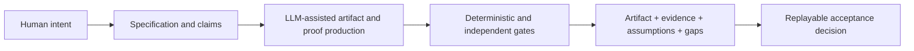

> This is a reviewed synthesis of my handwritten [README](README.md), the public repositories, and my later clarifications. It is not a sentence-by-sentence rewrite or a grammatically polished mirror of the rough README: it reorganizes, narrows, extends, and sometimes corrects that note as the work develops. The direction and accepted judgments are mine. LLMs produced the prose, but I read, review, and adapt it; this page is the formulation I currently accept and take responsibility for.

# Ivo Matijašević

MSc in mathematics and computer science. More than ten years building Erlang systems.

I am exploring a long-term question:

> **If machines make software cheap to produce, can they also make its acceptance precise, reproducible, and honest?**

My working thesis is that LLMs change the economics of formal methods. They can help write specifications, proof harnesses, tests, and proofs at a scale that was previously impractical. That does not make software automatically correct. It may make it practical to ship important software with a much stronger account of why particular claims about it should be accepted.

## This page is part of the experiment

One of my bottlenecks is translating an idea for other people. I think and communicate in a compressed way: examples may be approximate, premises remain unstated, and terminology moves. Once I understand an idea, I tend to forget which introduction a new reader still needs. I also have little patience for repeatedly packaging an idea in academic or marketing form. Before LLMs, many things I thought worth exploring would simply have stayed in my head.

LLMs materially change that. I can give them rough language, fragments, corrections, and an accumulated repository history; they can reconstruct missing context, propose precise interpretations, explain the idea to a new reader, and help turn it into specifications, papers, proofs, software, and maintained public repositories. I can spend more of my attention choosing the intended meaning, challenging the result, and deciding what I am willing to claim. In that sense, I use LLMs as extensions of my working capacity—and as something like **Grammarly for ideas**, not only for sentences.

The amount of work I can now externalize is itself evidence of LLM leverage. It is not evidence that the resulting claims are correct. That remains the burden of specifications, proofs, tests, negative controls, review, and explicit uncertainty.

This is not mind-reading, and fluency is not evidence that a model understood me correctly. Several precise interpretations may fit the same rough thought. The collaboration works especially well here because the destination is rigorous: an interpretation must eventually become a definition, executable property, formal statement, proof obligation, test, or explicit assumption. Proof failures, counterexamples, negative controls, and review can then push back. A perfectly verified misunderstanding is still a misunderstanding, so I make the final choice and remain responsible for it.

| Participant | Role |
|---|---|
| **Me** | Intent, direction, judgment, correction, acceptance, and responsibility |
| **LLMs** | Context reconstruction, candidate formalization, critique, explanation, and artifact production |
| **Formal and executable gates** | Bounded, reproducible decisions about the claims they are actually capable of checking |

The rough [README](README.md) and this synthesis are deliberately kept together. The first preserves how I actually expressed the idea at one point in its development. The second is not its polished duplicate: it uses the wider estate and continued dialogue to build the clearest current picture, including qualifications and connections that were not present in the original note. Together they show how much more of an idea becomes communicable and actionable through the human–LLM–verification loop.

## The bet

Software may separate into three broad paths:

| Path | Suitable use | Acceptance basis |
|---|---|---|
| **Legacy software** | Existing systems not designed around machine production | Existing engineering and operational practice |
| **Disposable software** | Low-stakes, short-lived, generated applications | Proportionate lightweight checks |
| **Specification-derived software** | Components whose failure matters | Explicit properties, machine-checked evidence, tests, assumptions, bounds, and known gaps |

I sometimes call the third category “correct code,” but the precise meaning matters: **correctness is always relative to a stated specification, assumptions, toolchain, and proof boundary.** It is not a claim that the entire system is flawless.

The civil-engineering analogy behind the project is simple. Software generation lets us build higher; verification is the steel; clear assumptions, definitions, and specifications are the foundation. The strongest core of a serious system should aim to be:

- **Correct with respect to named properties** — the delivered evidence establishes those properties over its declared domain.
- **Sound at its critical boundaries** — relevant panic, undefined-behavior, and corruption risks are ruled out where the checks say they are.
- **Secure by stated construction** — security properties are specified and checked, not inferred from test volume.

These are goals for the class of software I want to help produce. They are not blanket claims about every artifact in these repositories.

## Acceptance is the product boundary

A patch that passes its tests is not yet a defensible delivery. For work that matters, I want the delivered unit to contain:

1. the exact artifact;
2. the properties or specification being claimed;
3. the tests, proofs, and other procedures actually run;
4. evidence bound to that artifact;
5. the assumptions, bounds, trusted base, and known gaps; and
6. enough information for another party to replay the decision.

I call this **acceptance-complete** output. It does not mean “proved completely.” It means the acceptance case is complete enough to say `ACCEPT`, `REJECT`, or `INCOMPLETE` without silently turning missing evidence into confidence.

The diagram is a target architecture, not a claim that the entire chain is finished or autonomous today.

## The public work

The repositories are intended to form one experimental stack:

### [Acceptance Format](https://github.com/ivmat/acceptance-format) — the record

A public living draft for recording what verification decided, and what it did not. A claim receives evidentiary weight only when it has a declared grade, a runnable procedure, bound evidence, and a witness that the procedure can fail. Unsupported claims remain visible but unweighted.

This is not a standard, certification scheme, or truth oracle. A valid manifest can report evidence honestly; it cannot prove that a human chose the right specification.

### [rs-verified-der](https://github.com/ivmat/rs-verified-der) — the worked subject

A Rust implementation of selected DER/X.690 encoding and decoding behavior. It combines conventional tests, Kani proofs of bounded properties, selected Aeneas-to-Lean functional-correctness “lids,” and a packaged acceptance record.

It is substantial evidence over named slices. It is **not** a proof of complete DER or X.509 correctness, absence of every vulnerability, or independent certification.

### [autoprover-core](https://github.com/ivmat/autoprover-core) — the public production pattern

A proof-producing pipeline pattern: an append-only work queue, pluggable kernel gate, receipts, structural audits, and a monotone ratchet, accompanied by a corpus of machine-checked Lean modules.

This is the public core and an architectural demonstration. It is not the complete private engine or a finished autonomous software producer.

### Upstream work — testing the approach outside my own repositories

I contribute to [Kani](https://github.com/model-checking/kani) and participate in [verify-rust-std](https://github.com/model-checking/verify-rust-std). Merged contributions are useful evidence that some work survives another project's review and constraints. Open submissions remain open; they are not counted as accepted results.

## The papers

My literature search did not find this exact synthesis and threshold formulation, so I wrote three public preprints. Their LaTeX sources, simulations, assumptions, and reproduction instructions are in [gated-computation-sim](https://github.com/ivmat/gated-computation-sim).

1. [A fault-tolerance threshold for gated agentic computation](https://zenodo.org/records/20820968) develops a model and proposes a falsifiable agent experiment: same-family gate depth should initially help and then plateau where faults are shared; genuinely different or execution-grounded checks may move that plateau.
2. [Generated gates inherit their generator's blind spots](https://zenodo.org/records/20837102) studies representation-relative blind sets and why more checking from the same representational family may leave a residual floor.
3. [Escape, cost, and correlation at the verification floor of gated agentic computation](https://zenodo.org/records/21456783) connects the model to assurance structure and conditional cost calculations.

These are preprints, not peer-reviewed empirical results. The first paper's deployed-agent experiment has not yet been run. The models motivate tests; they do not establish that present coding agents already achieve the proposed reliability.

## Ground what can be grounded

Every system rests on assumptions. The dangerous assumptions are the unnamed ones.

> **Within an acceptance case, a supporting claim should be derived, backed by named evidence under explicit assumptions, or clearly recorded as an assumption or assertion. Its status should not remain hidden.**

Compilers, libraries, solvers, proof kernels, hardware, specifications, and human intent all create trust boundaries. The goal is not to claim that assumptions disappear. It is to reduce them where useful, expose the remainder, and bind every conclusion to the layer that actually supports it.

The hardest boundary is the specification. Machines can increasingly check whether code meets a formal statement. They cannot make the statement correspond to human intent merely by checking it harder. Specification and agreement about intent are therefore the second pillar of this work; economical verification is the first.

## How the work is produced

Almost nothing in the estate is handwritten. The plain [README](README.md) is my original note; LLM workers generated most code, proofs, documentation, and this page. I direct the work and read, review, and adapt its outward-facing results rather than publishing them unexamined.

That is part of the experiment, but it is not evidence by itself. The operating rules are:

- stochastic models propose; deterministic tools decide only what they are capable of deciding;
- a green gate is not trusted until a relevant negative control has been observed failing;
- restricted results are labeled with their restriction;
- assumptions and residual gaps remain part of the artifact;
- cross-model review is useful criticism, but it is not independent certification; and
- I remain responsible for intent, scope, public claims, and acceptance decisions.

Formal checkers also have trusted bases and specification risks. “The verifier is the oracle” is useful shorthand only within a declared model; it is never permission to erase those boundaries.

## Current state and the next test

There is enough public work here to inspect, reproduce, criticize, and use as the basis of a bounded evaluation. There is not yet independent institutional adoption, a production software factory, a validated business, or evidence that the whole approach generalizes.

The next important question is experimental:

> Can a coding agent deliver a software change together with precise claims, replayable evidence, explicit residuals, and negative controls—and can an independently controlled evaluator reject both seeded faults and inflated claims?

A useful result could be positive or negative. If the proposed acceptance unit adds no signal beyond existing evaluation records, if independent replay depends on private context, or if it cannot distinguish `INCOMPLETE` from `ACCEPT`, that is evidence against the current design.

I welcome adversarial review: point to the strongest overclaim, the hidden assumption, the duplicate idea, or the smallest experiment that would disprove the thesis. The work is public so that criticism can make it narrower and more useful.
